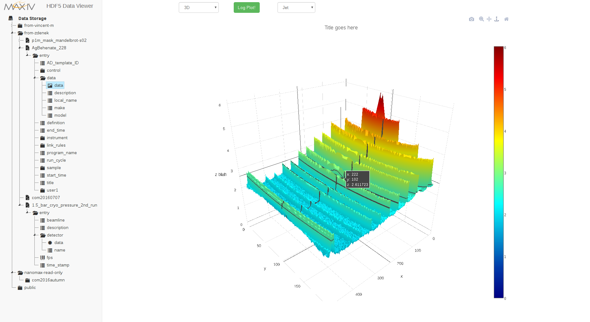
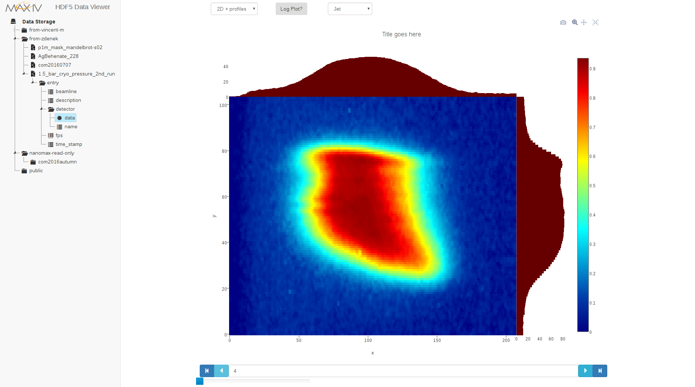
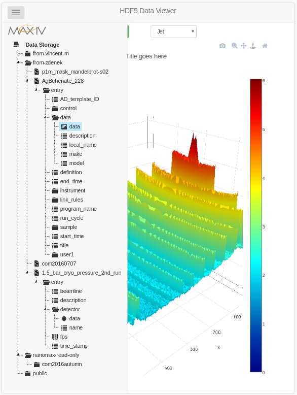

# PRESENT STATUS

## JUST STARTED

This is a web GUI for viewing HDF5 files.

The HDF5 Group  [made their own web ui](http://data.hdfgroup.org/),
but they don't want to share :(

They do however want to share their very nice HDF5 file server backend, so we
have that going for us, which is nice.

This web GUI is written in javascript and make use of the
[plotly](https://plot.ly/javascript/) graphing libraries.

This GUI and the REST server backend both have some ~~bugs~~ issues at this
point, hopefully they will be fixed soon :)

## SCREENSHOTS
3-dimensional, rotatable, zoomable plots of data can be made. Here's a
screenshot:

Here's a screenshot of a 2-dimensional zoomable contour plot from a series of
images,  with x and y profile histograms that match the zoomed-in area:

And here is a view the application when displayed on a mobile device, the hidden
menu has been clicked, which can then be hidden to just display the plot:

